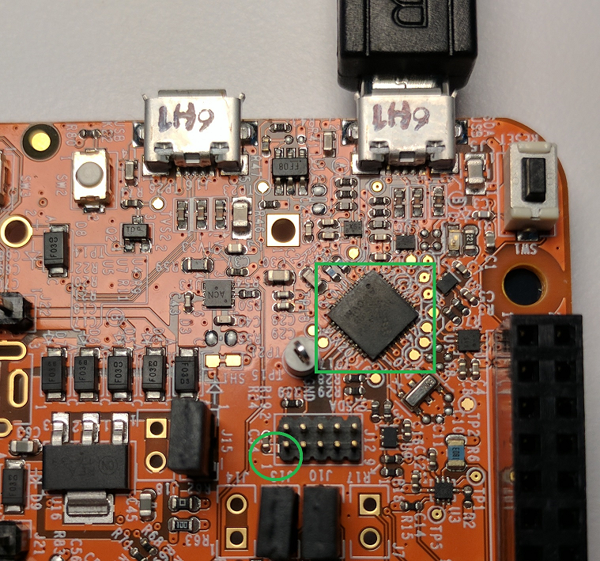

# Unbricking Guide for mbed Devices
Older versions of DAPLink can potentially brick your NXP/Freescale microcontroller if you attempt to update its firmware on a Windows 10 machine. This bricking is a result of the device's bootloader getting overwritten improperly during the flashing process. If your device is bricked, this guide will help you in recovering your board.

Before starting the unbricking process, it will be helpful to determine whether the actual bootloader on your target bricked, or rather if its interface was corrupted. Without going into details on what the difference is between the two, the flowchart below will help determine what needs to be done to recover your board.


## Unbricking bootloader
Follow the steps in this section if the flowchart at the beginning of the document determined that your board's bootloader has been bricked.

### Required items
* [pyOCD](https://github.com/mbedmicro/pyOCD).
* [CMSIS-DAP debugging probe](https://developer.mbed.org/platforms/SWDAP-LPC11U35/).
* [10 pin debug cable](https://www.adafruit.com/product/1675).
* [DapLink firmware](TODO: NEED TO UPDATE ONCE NEW DAPLINK IS RELEASED).

### Step 1: Install pyOCD
pyOCD is an Open Source Python 2.7 based library for programming and debugging ARM Cortex-M microcontrollers using the CMSIS-DAP linked above. In a terminal, you can install pyOCD using the following command (install as superuser if using a Linux machine):
`pip install pyOCD`

### Step 2: Connect debugger to bricked board
Locate the 10-pin header associated with your board's k20dx flash. Usually, the header is near the OpenSDA USB port on the device. Connect your 10-pin debug cable to this header, so pin 1 of the header connects to the red wire on your debug cable, as seen in the image below. The pin numbering is printed on the silkscreen of your board for your reference. After you have connected the debugger to your board, ensure that both the debugger and the bricked board are plugged into a power source (usually via USB cable).




### Step 3: Flashing bricked board
Now you are ready to flash the bricked board with the updated DapLink firmware. This firmware should have already been downloaded previously in the Required items section of this tutorial. To run pyOCD's flashtool, use the command below (run with superuser privileges if using a Linux machine). Note, replace `<PATH TO DAPLINK BINARY>` with path location of the DapLink binary on your system.

`pyocd-flashtool <PATH TO DAPLINK BINARY> -t k20d50m`

If you have multiple devices connected to your computer, the console will prompt you to specify which device pyOCD should use as the debugger. The output looks similar to the following:
```
id => usbinfo | boardname
0 => NXP LPC800-MAX [k20d50m]
1 => FRDM-K64F [k20d50m]
input id num to choice your board want to connect
```
In this list, `id=0` represents the debugger. Therefore, you would type `0` and then hit `Enter`.

The unbricking begins, and the terminal reports something like the following:

```
INFO:root:DAP SWD MODE initialised
WARNING:root:K20D50M in secure state: will try to unlock via mass erase
WARNING:root:K20D50M secure state: unlocked successfully
INFO:root:ROM table #0 @ 0xe00ff000 cidr=b105100d pidr=4000bb4c4
INFO:root:[0]<e000e000:SCS-M3 cidr=b105e00d, pidr=4000bb000, class=14>
WARNING:root:Invalid coresight component, cidr=0x0
INFO:root:[1]<e0001000: cidr=0, pidr=0, component invalid>
INFO:root:[2]<e0002000:FPB cidr=b105e00d, pidr=4002bb003, class=14>
WARNING:root:Invalid coresight component, cidr=0xb1b1b1b1
INFO:root:[3]<e0000000: cidr=b1b1b1b1, pidr=b1b1b1b1b1b1b1b1, component invalid>
WARNING:root:Invalid coresight component, cidr=0x0
INFO:root:[4]<e0040000: cidr=0, pidr=0, component invalid>
INFO:root:CPU core is Cortex-M4
INFO:root:6 hardware breakpoints, 4 literal comparators
INFO:root:4 hardware watchpoints
[====================] 100%
INFO:root:Programmed 131072 bytes (128 pages) at 25.32 kB/s

```

### Step 4: Verify
Now, unplug and replug the board into your computer normally (without holding down the reset button). The device mounts normally.

## Interface recovery
Follow the steps in this section if the flowchart at the beginning of the document determined that your board's interface has been corrupted.

### Required items
* Windows 7 machine
* [DapLink firmware](TODO: NEED TO UPDATE ONCE NEW DAPLINK IS RELEASED).

### Step 1: Enter device into bootloader mode
Hold down the reset button on your board, and while holding down the button, plug it into a Windows 7 machine. The board should mount as a `BOOTLOADER`.


### Step 2: Drag working binary onto your device
Drag and drop your binary onto the device while it is in bootloader mode.

### Step 3: Verify
Now, unplug and replug the board into your computer normally (without holding down the reset button). The device mounts normally.
