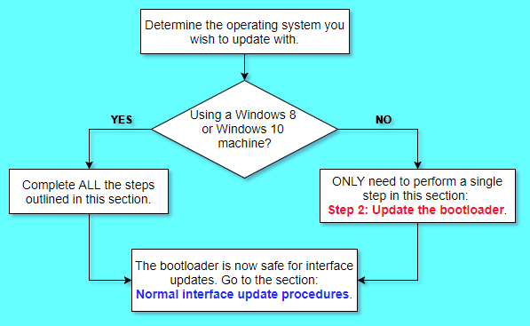
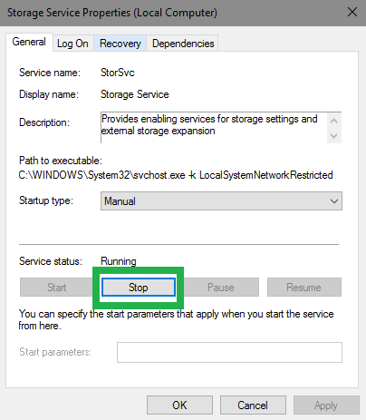

# Mbed Enabled boards and Windows 10
There have been questions asked in the forums about Windows 10 bricking mbed Enabled development boards when updating the interface firmware. We decided to look further into this to understand, reproduce, and find a solution to the problem. The symptom has been described as "bricking" or not mounting as a mass storage drive when connected to the computer over USB. During the investigation, we found that the problem can manifest itself in two different ways, with both cases making the boards appear bricked. In one case, the interface application receives data in an unexpected order causing the application to crash on reboot. In the second case, the out of order sequence erases the bootloader, resulting in a bricked device. While this could happen on any operating system, it has only manifested on Windows 8 and 10 machines when storage services are running. The user facing result of this is that updating DAPLink firmware on a Windows 8 or 10 machine can result in a bricked bootloader or corrupted application interface, both of which will prevent the user's application from running.

We have determined that NXP/Freescale development boards containing bootloader version 1000 are susceptible for bricking. NXP/Freescale development boards containing interface version below 0240 are susceptible to having their interfaces corrupted. We are uncertain of all the boards and their revisions that came packaged with these versions, but either way, if you believe your device is bricked or corrupted, or worried that it may become bricked or corrupted, this guide will help you in recovering and updating your board properly. After performing the update, your board should no longer be susceptible to bricking/corruption from the reasons explained above. Also, the procedures outlined in this document will NOT leave your board in a unrecoverable state. Begin by following the flowchart below to determine what needs to be done to recover and/or safely update the DAPLink firmware on your board.


If the flowchart determined that your bootloader is still intact, then follow the steps in the section `Safely update device`. Else, if the flowchart determined that your bootloader was bricked, then follow the steps in the section `Reprogramming the bootloader`.

## Safely update device
To recover a board which still has its bootloader intact, we just need to reprogram the debug interface application.



### Required items
* [DAPLink debug application](TODO: NEED TO UPDATE ONCE NEW DAPLINK IS RELEASED).

### Step 1: Disable storage services
On your Windows 8/10 machine, press and hold the Windows Logo Key and then press R. This will open the windows _Run_ prompt. Once the _Run_ prompt opens, type in ```services.msc``` and click the _OK_ button.


Once the Services application opens, double click the item from the list named _Storage Service_.  


Storage Service Properties is now open. Click the button named _Stop_.



### Step 2: Update interface application
While holding the board's reset button, connect it to your computer via the board's OpenSDA UDB port. A device will mount with the name _BOOTLOADER_, _MAINTENANCE_, or something similar, depending the board you are updating. Open up this device's directory, and then drag and drop the latest [DAPLink interface application](TODO: add download link for file). The board will begin the updating process.

### Step 3: Verify
Allow the update a few seconds to complete, and then unplug and replug the board into your computer normally (without holding down the reset button). The device mounts normally, and the update is complete.

### Step 4: Re-enable storage services
Turn storage services back on by following the same steps listed in ```Step 1: Disable storage services```, but this time click the button name _Start_ instead of _Stop_.

## Reprogramming the bootloader
If your bootloader has been partially erased we can use a debugger to reprogram an updated bootloader.

### Required items
* Debugger (Step 1 below will discuss various options available).
* [pyOCD](https://github.com/mbedmicro/pyOCD).
* [10 pin debug cable](https://www.adafruit.com/product/1675).
* [DAPLink bootloader](TODO: add download link for file).
* [DAPLink interface application](TODO: add download link for file)

### Step 1: Acquire a debugger
There are a few different options here when it comes to using the debugger to reprogram your bootloader. One option is to use a [CMSIS-DAP](https://developer.mbed.org/platforms/SWDAP-LPC11U35/) debugging probe. Alternatively, it is possible to use another FRDM board to program your bricked board. Depending on the board, a SWD header needs to be soldered on the board and jumpers set or traces cut. Here are some tutorials on how to modify the [FRDM-K64F](https://mcuoneclipse.com/2015/09/08/using-frdm-k64f-board-to-debug-another-kinetis-board/), [FRDM-KL25Z](https://mcuoneclipse.com/2013/04/21/using-the-freedom-board-as-jtag-programmer/), and [FRDM-KL43Z](https://mcuoneclipse.com/2015/08/19/using-the-freescale-freedom-frdm-kl43z-to-debug-other-boards/) to do just that.

### Step 2: Install pyOCD
pyOCD is an Open Source Python based library for programming and debugging ARM Cortex-M microcontrollers using a debugger. With Python 2.7 installed, you can then install pyOCD using the following command (install as superuser if using a Linux machine):
`pip install pyOCD`

### Step 3: Connect debugger to bricked board
Locate the 10-pin header associated with your bricked board's k20dx interface MCU. Usually, the header is near the OpenSDA USB port on the device. Connect your 10-pin debug cable to this header, so pin 1 of the header connects to the red wire on your debug cable. The pin numbering is printed on the silkscreen of your board for your reference. I drew a green square around the k20dx interface MCU, and a green circle around pin 1 of its corresponding 10-pin header in the image below.


After this, connect the debugger to your board. Ensure that both the debugger and the bricked board are plugged into your computer via USB cable. Below is an example of using a FRDM-K64F as a debugger to reprogram a bricked FRDM-K22F.


### Step 4: Flashing the new bootloader
Now you are ready to flash the board with the updated [DAPLink bootloader](TODO: Link bootloader file here). To run pyOCD's flashtool, use the command below (run with superuser privileges if using a Linux machine). Note, replace `<PATH TO DAPLINK BINARY>` with file location of the DAPLink binary on your system.

`pyocd-flashtool <PATH TO DAPLINK BINARY> -t k20d50m`

If you have multiple devices connected to your computer, the console will prompt you to specify which device pyOCD should use as the debugger. The output will look similar to the following:
```
id => usbinfo | boardname
0 => NXP LPC800-MAX [k20d50m]
1 => FRDM-K64F [k20d50m]
input id num to choice your board want to connect
```
From this list, choose the id number which represents your debugger and then hit `Enter`.

The reprogramming begins, and the terminal reports something like the following:

```
INFO:root:DAP SWD MODE initialised
WARNING:root:K20D50M in secure state: will try to unlock via mass erase
WARNING:root:K20D50M secure state: unlocked successfully
INFO:root:ROM table #0 @ 0xe00ff000 cidr=b105100d pidr=4000bb4c4
INFO:root:[0]<e000e000:SCS-M3 cidr=b105e00d, pidr=4000bb000, class=14>
WARNING:root:Invalid coresight component, cidr=0x0
INFO:root:[1]<e0001000: cidr=0, pidr=0, component invalid>
INFO:root:[2]<e0002000:FPB cidr=b105e00d, pidr=4002bb003, class=14>
WARNING:root:Invalid coresight component, cidr=0xb1b1b1b1
INFO:root:[3]<e0000000: cidr=b1b1b1b1, pidr=b1b1b1b1b1b1b1b1, component invalid>
WARNING:root:Invalid coresight component, cidr=0x0
INFO:root:[4]<e0040000: cidr=0, pidr=0, component invalid>
INFO:root:CPU core is Cortex-M4
INFO:root:6 hardware breakpoints, 4 literal comparators
INFO:root:4 hardware watchpoints
[====================] 100%
INFO:root:Programmed 131072 bytes (128 pages) at 25.32 kB/s

```

### Step 5: Update interface application
The bootloader should now be updated. Next you will update your board's interface. While holding the board's reset button, connect it to your computer via the board's OpenSDA UDB port. A device will mount as _MAINTENANCE_. Open up this device's directory, and then drag and drop the latest [DAPLink interface application](TODO: add download link for file). The board will begin the updating process and should complete after a few seconds.

### Step 6: Verify
Now, unplug and replug the board into your computer normally (without holding down the reset button). The device mounts normally, and the update is complete.
